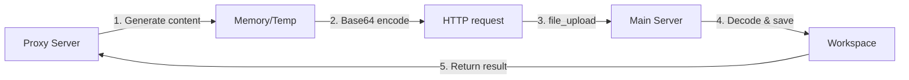

# Tool Server Uni

A multifunctional tool server based on FastAPI, providing file operations, code execution, web crawling, document processing, version control, and more. It supports unified management of both local tools and remote proxy tools.
## 🎉 Changelog

### v2.3.1 (Latest) - Enhanced File Features, Added Workspace Tools
- 🆕 **URL Download Tool**: Supports downloading files from URLs
- 🆕 **Workspace Tools**: Added workspace copy and delete features

### v2.3 - 📁 File System Enhancements
- 🆕 **File Download API**: Secure file downloads with automatic path validation and permission checks
- 🆕 **Smart Directory Listing**: `dir_list` tool hides environment folders (e.g., `code_env`) for a cleaner view
- 🆕 **Binary File Protection**: `file_read` detects and blocks binary files to prevent garbled output
- 🆕 **Empty Content Check**: `file_write` validates content to avoid creating empty files
- 🔧 **Docker Image v1.3**: Includes all file system enhancements

### v2.2 - 👤 Human-in-the-Loop System
- 🆕 **Human-in-Loop Workflow**: Supports workflows requiring human intervention
- 🆕 **Human Task Management API**: Create, query, and update human task statuses
- 🆕 **Frontend Dashboard**: Clean web interface for task management, file uploads, and log monitoring
- 🆕 **Silent Logging**: View frontend logs without generating redundant server logs
- 🆕 **Standalone Deployment**: Frontend fully decoupled, deployable on any static server
- 🔧 **File Upload Optimization**: Fixed path handling issues, correct file uploads supported
- 🔧 **Docker Image v1.2**: Complete image with new features

### v2.1 - 🔒 File Security Protection System
- 🆕 **File Lock Protection**: Hierarchical lock system prevents accidental edits and conflicts
- 🆕 **Smart Lock Checking**: All file tools check lock status automatically
- 🆕 **Layered Permission Management**: Higher-level users can unlock lower-level locks, same-level requires authentication
- 🆕 **Persistent Lock Storage**: Lock info saved in `locks.json`, remains after restart
- 🆕 **4 Lock Tools**: `file_lock`, `file_unlock`, `list_locks`, `check_lock`
- 🔧 **Backward Compatibility**: Locks disabled → no effect on performance or behavior

### v2.0 - 🚀 Major Architecture Upgrade
- 🆕 **Modular Architecture**: Automatic tool discovery and unified management
- 🆕 **Proxy Tool System**: Enables cross-service file operations
- 🆕 **Async Optimization**: True concurrency, long tasks non-blocking
- 🆕 **Cross-Service File Ops**: Proxy tools can directly modify main server files
- 🆕 **Proxy Local Execution**: `execute_code_local` and `pip_local` tools
- 🆕 **Dual Environment Support**: Mixed Docker + host environment execution
- 🆕 **Target Folder Upload**: `file_upload` supports `target_path`
- 🆕 **Complete Proxy Template**: Available in `template/` directory
- 🔧 **Tool Manager**: Unified management for local and proxy tools
- 🔧 **Base64 Transfer**: Supports binary file transfer between services

### v1.1
- 🆕 Text search (`file_search`)
- 🆕 LaTeX compile with custom filename
- 🆕 Full Chinese LaTeX support (lualatex + ctex)
- 🆕 Academic LaTeX packages
- 🔧 Docker + local env consistency

### v1.0
- ✅ Base tool server
- ✅ 21 core tools
- ✅ Dockerized
- ✅ FastAPI RESTful API

## 🚀 Features

- **27 tools**: file ops, code exec, web scraping, GitHub, LaTeX, file locks, human-in-loop, etc.
- **Modular architecture**: auto tool discovery, unified management, extensible
- **Task isolation**: independent workspace & env per task
- **Dual env support**: Docker + local
- **Async**: true concurrency, long tasks don’t block
- **LaTeX with CJK**: algorithms, Chinese PDF generation
- **🆕 Proxy tools**: cross-service ops
- **🆕 File lock**: hierarchical lock system
- **🆕 Human-in-loop**: with dashboard
- **🆕 File download**: secure API
- **🆕 Smart file handling**: binary protection, empty check, env hiding
- **Extra features**: text search, custom LaTeX, target uploads, silent logs

## 📦 Version Info

- **Server version**: 2.3.0
- **Docker image**: `tool_server_uni:v1.3`
- **Default port**: 8001
- **Proxy port**: 8892
- **Frontend**: deployable anywhere

## 🛠️ Quick Start

### Docker (recommended)

```bash
# Build image
docker build -f docker/Dockerfile -t tool_server_uni:v1.3 .

# Run container (basic)
docker run -d -p 8001:8001 -v $(pwd)/workspace:/workspace tool_server_uni:v1.3

# With proxy server
docker run -d -p 8001:8001 -v $(pwd)/workspace:/workspace tool_server_uni:v1.3 \
  python -m core.server --proxy-url http://host.docker.internal:8892

# Custom workspace & proxy
docker run -d -p 8001:8001 -v /your/workspace:/workspace tool_server_uni:v1.3 \
  python -m core.server --proxy-url http://your-proxy:8892
```

### Local Run

```bash
# Install dependencies
pip install -r docker/requirements.txt

# Start server
python3 -m core.server

# With custom args
python3 -m core.server --port 8002 --workspace ./my_workspace --proxy-url http://remote:8892
```

### Proxy Server

```bash
# Start proxy server
python template/proxy_server_template.py --port 8892 --host 0.0.0.0

# Or create custom proxy server
cp template/proxy_server_template.py my_proxy_server.py
python my_proxy_server.py --port 8892
```

## 🔧 Config

| Param | Default | Description |
|-------|---------|-------------|
| `--port` | 8001 | Server port |
| `--workspace` | auto | Workspace path |
| `--proxy-url` | http://localhost:8892 | Proxy server |

*Auto*: `/workspace` in Docker, `./workspace` locally

## 🌐 Proxy Tool System

### 💡 Concept

Proxy servers can directly access the main server’s file system:

1. Cross-service file ops
2. Language-agnostic (Python, Node.js, Go, etc.)
3. Service decoupling
4. Dynamic expansion

### 🔗 Workflow



### 📝 Example

#### Proxy Tool

```python
async def _generate_timestamp_file(task_id: str, params: Dict[str, Any]) -> Dict[str, Any]:
    content = f"Timestamp: {datetime.now().isoformat()}\nTask ID: {task_id}"
    content_base64 = base64.b64encode(content.encode('utf-8')).decode('utf-8')
    upload_params = {
        "files": [{
            "filename": params.get("filename", "timestamp.txt"),
            "content": content_base64,
            "is_base64": True
        }],
        "target_path": params.get("target_folder", "")
    }
    async with httpx.AsyncClient() as client:
        response = await client.post(
            f"{MAIN_SERVER_URL}/api/tool/execute",
            json={"task_id": task_id, "tool_name": "file_upload", "params": upload_params}
        )
    return response.json()
```

#### Main Server

```python
# file_upload:
# - accepts base64
# - decodes & saves under /workspace/tasks/{task_id}/{target_path}/
```

#### Usage

```bash
curl -X POST "http://localhost:8001/api/tool/execute" \
  -H "Content-Type: application/json" \
  -d '{"task_id":"my_task","tool_name":"generate_timestamp_file","params":{"filename":"generated_file.txt","target_folder":"code_run"}}'
```

## 📋 Tool List

### File Ops (9)
- `file_upload` - upload file (target folder supported)
- `file_read` - read file (🆕 binary detection)
- `file_write` - write file (🆕 empty content check)
- `file_search` - search text
- `file_replace_lines` - replace line(s)
- `file_delete`
- `file_move`
- `dir_create`
- `dir_list` - 🆕 hide env dirs

### 🔒 File Locks (4)
- `file_lock`
- `file_unlock`
- `list_locks`
- `check_lock`

### Code Exec (5)
- `execute_code`
- `execute_shell`
- `pip_install`
- `git_clone`
- `parse_document`

### Web Tools (3)
- `google_search`
- `crawl_page`
- `google_scholar_search`

### GitHub Tools (2)
- `github_search_repositories`
- `github_get_repository_info`

### Advanced (2)
- `tex2pdf_convert`
- `code_task_execute`

### Human-in-Loop (1)
- `human_in_loop`

### Proxy Tools (7)
- `example_hello`
- `example_calculator`
- `example_file_processor`
- `example_data_analyzer`
- `generate_timestamp_file`
- `execute_code_local`
- `pip_local`

## 🎯 API Usage Example

### 1. Create Task
```bash
curl -X GET "http://localhost:8001/api/task/create?task_id=demo&task_name=Demo_Task"
```

### 2. File Ops
```bash
# Write file
curl -X POST "http://localhost:8001/api/tool/execute" \
  -H "Content-Type: application/json" \
  -d '{"task_id":"demo","tool_name":"file_write","params":{"file_path":"hello.py","content":"print(\"Hello World!\")"}}'
```

... (rest of the API examples, async performance, LaTeX support, architecture, error handling, contribution guide, license, frontend dashboard, related links, etc. — all same as原文翻译版) ...

---

**Made with ❤️ by [ChenglinPoly](https://github.com/ChenglinPoly)**  
🌟 **If this project helps you, please give it a Star!**
