# Tool Server Uni

一个基于 FastAPI 的多功能工具服务器，提供文件操作、代码执行、网页爬取、文档处理、版本控制等功能。支持本地工具和远程代理工具的统一管理。
## 🎉 更新日志

### v2.2 (Latest) - 👤 人机交互系统
- 🆕 **Human-in-Loop功能**：支持人工干预的工作流程，创建人类任务并等待完成
- 🆕 **人类任务管理API**：完整的任务创建、查询、状态更新API
- 🆕 **前端管理界面**：简洁的Web界面，支持任务管理、文件上传、日志监控
- 🆕 **静默日志功能**：前端日志查看不产生冗余服务器日志
- 🆕 **独立部署支持**：前端界面完全解耦，可部署到任何静态服务器
- 🔧 **文件上传优化**：修复路径处理问题，支持正确的文件上传
- 🔧 **Docker镜像v1.2**：包含所有新功能的完整镜像

### v2.1 - 🔒 文件安全保护系统
- 🆕 **文件锁保护系统**：支持等级制文件锁定，防止意外修改和并发冲突
- 🆕 **智能锁检查**：所有文件操作工具自动检查锁状态，非侵入式设计
- 🆕 **层级权限管理**：高等级用户可无条件解锁低等级，同级需要身份验证
- 🆕 **持久化锁存储**：锁信息保存到locks.json，服务重启后保持有效
- 🆕 **4个锁管理工具**：file_lock、file_unlock、list_locks、check_lock
- 🔧 **向后兼容**：不使用锁功能时完全不影响原有性能和行为

### v2.0 - 🚀 重大架构升级
- 🆕 **模块化架构重构**：自动工具发现，统一管理
- 🆕 **代理工具系统**：支持跨服务文件操作的创新功能
- 🆕 **异步处理优化**：真正的并发，长任务不阻塞
- 🆕 **跨服务文件操作**：代理工具可直接操作主服务器文件系统
- 🆕 **代理服务器本地执行**：execute_code_local和pip_local工具
- 🆕 **双环境支持**：Docker容器+宿主机环境混合执行
- 🆕 **指定目标文件夹上传**：file_upload支持target_path参数
- 🆕 **完整代理模板**：template/目录提供完整的代理服务器模板
- 🔧 **工具管理器**：ToolManager统一管理本地和代理工具
- 🔧 **Base64文件传输**：支持二进制文件的跨服务传输

### v1.1
- 🆕 新增文本搜索功能 (`file_search`)
- 🆕 LaTeX支持指定文件名编译
- 🆕 完整中文LaTeX支持 (lualatex + ctex)
- 🆕 丰富的学术LaTeX宏包支持
- 🔧 Docker环境和本地环境一致性

### v1.0
- ✅ 基础工具服务器
- ✅ 21个核心工具
- ✅ Docker容器化支持
- ✅ FastAPI RESTful API

## 🚀 特性

- **27个工具**：文件操作、代码执行、网页爬取、GitHub集成、LaTeX编译、文件锁管理、人机交互等
- **模块化架构**：自动工具发现，统一管理，易于扩展
- **任务隔离**：每个任务独立的工作空间和虚拟环境
- **双环境支持**：Docker容器化部署和本地开发运行
- **异步处理**：真正的并发支持，长时间任务不阻塞其他请求
- **中英文LaTeX**：支持算法包和中文PDF生成
- **🆕 代理工具系统**：支持远程工具服务器，可跨服务操作文件
- **🆕 跨服务文件操作**：代理工具可直接操作主服务器内部文件系统
- **🆕 文件锁保护系统**：支持等级制文件锁定，防止意外修改和并发冲突
- **🆕 人机交互系统**：支持人工干预的工作流程，完整的前端管理界面
- **新增功能**：文本搜索、指定LaTeX文件编译、指定目标文件夹上传、静默日志

## 📦 版本信息

- **服务器版本**: 2.0.0
- **Docker镜像**: `tool_server_uni:v1.2`
- **默认端口**: 8001
- **代理端口**: 8892 (默认)
- **前端界面**: 独立部署，支持任意静态服务器

## 🛠️ 快速开始

### Docker 运行（推荐）

```bash
# 构建最新镜像
docker build -f docker/Dockerfile -t tool_server_uni:v1.2 .

# 启动容器（基本模式）
docker run -d -p 8001:8001 -v $(pwd)/workspace:/workspace tool_server_uni:v1.2

# 启动容器（连接代理服务器）
docker run -d -p 8001:8001 -v $(pwd)/workspace:/workspace tool_server_uni:v1.2 \
  python -m core.server --proxy-url http://host.docker.internal:8892

# 或指定自定义工作空间和代理
docker run -d -p 8001:8001 -v /your/workspace:/workspace tool_server_uni:v1.2 \
  python -m core.server --proxy-url http://your-proxy:8892
```

### 本地运行

```bash
# 安装依赖
pip install -r docker/requirements.txt

# 启动服务器
python3 -m core.server

# 或使用自定义参数
python3 -m core.server --port 8002 --workspace ./my_workspace --proxy-url http://remote:8892
```

### 代理服务器运行

```bash
# 启动代理服务器（基于模板）
python template/proxy_server_template.py --port 8892 --host 0.0.0.0

# 或创建自定义代理服务器
cp template/proxy_server_template.py my_proxy_server.py
# 编辑 my_proxy_server.py 添加你的工具
python my_proxy_server.py --port 8892
```

## 🔧 配置参数

| 参数 | 默认值 | 说明 |
|------|--------|------|
| `--port` | 8001 | 服务器端口 |
| `--workspace` | 自动检测* | 工作空间路径 |
| `--proxy-url` | http://localhost:8892 | 代理服务器地址 |

*自动检测：Docker环境使用`/workspace`，本地环境使用`./workspace`

## 🌐 代理工具系统

### 💡 设计思路

代理工具系统允许你创建独立的工具服务器，同时能够**直接操作主服务器的文件系统**。这种设计带来了以下优势：

1. **跨服务文件操作**：代理工具可以生成内容并保存到主服务器的任务目录
2. **技术栈自由**：代理服务器可以用任何语言实现（Python、Node.js、Go等）
3. **服务解耦**：专业工具独立部署，主服务器专注核心功能
4. **动态扩展**：无需修改主服务器即可添加新功能

### 🔗 跨服务文件操作原理

```mermaid
graph LR
    A[代理服务器] -->|1. 生成内容| B[内存/临时存储]
    B -->|2. Base64编码| C[HTTP请求]
    C -->|3. 调用file_upload| D[主服务器]
    D -->|4. 解码保存| E[任务文件系统]
    E -->|5. 返回结果| A
```



### 📝 实现示例

以下是代理工具操作主服务器文件的完整流程：

#### 1. 代理服务器端实现

```python
async def _generate_timestamp_file(task_id: str, params: Dict[str, Any]) -> Dict[str, Any]:
    """代理工具：生成时间戳文件并上传到主服务器"""
    
    # 1. 生成内容
    content = f"时间戳: {datetime.now().isoformat()}\n任务ID: {task_id}"
    
    # 2. 编码为base64
    content_base64 = base64.b64encode(content.encode('utf-8')).decode('utf-8')
    
    # 3. 调用主服务器的file_upload工具
    upload_params = {
        "files": [{
            "filename": params.get("filename", "timestamp.txt"),
            "content": content_base64,
            "is_base64": True
        }],
        "target_path": params.get("target_folder", "")  # 可指定目标文件夹
    }
    
    # 4. HTTP请求到主服务器
    async with httpx.AsyncClient() as client:
        response = await client.post(
            f"{MAIN_SERVER_URL}/api/tool/execute",
            json={
                "task_id": task_id,
                "tool_name": "file_upload", 
                "params": upload_params
            }
        )
    
    return response.json()
```

#### 2. 主服务器端处理

```python
# file_upload工具自动处理：
# 1. 接收base64编码的文件内容
# 2. 解码并保存到 /workspace/tasks/{task_id}/{target_path}/
# 3. 返回文件路径和元信息
```

#### 3. 实际使用示例

```bash
# 调用代理工具，生成文件到主服务器的code_run文件夹
curl -X POST "http://localhost:8001/api/tool/execute" \
  -H "Content-Type: application/json" \
  -d '{
    "task_id": "my_task",
    "tool_name": "generate_timestamp_file",
    "params": {
      "filename": "generated_file.txt",
      "target_folder": "code_run"
    }
  }'

# 结果：文件保存在 /workspace/tasks/my_task/code_run/generated_file.txt
```

### 🔧 支持的跨服务操作

代理工具可以通过调用主服务器的任何工具来操作文件系统：

| 主服务器工具 | 代理用途 | 示例场景 |
|-------------|---------|----------|
| `file_upload` | 上传生成的文件 | AI模型输出结果 |
| `file_write` | 直接写入文本 | 配置文件生成 |
| `file_read` | 读取已有文件 | 模板文件处理 |
| `execute_code` | 执行生成的代码 | 动态脚本运行 |
| `dir_create` | 创建目录结构 | 项目初始化 |

## 📋 工具清单

### 文件操作 (9个)
- `file_upload` - 文件上传（支持指定目标文件夹）
- `file_read` - 文件读取
- `file_write` - 文件写入
- `file_search` - 🆕 文本搜索（返回行号和位置）
- `file_replace_lines` - 行替换
- `file_delete` - 文件删除
- `file_move` - 文件移动
- `dir_create` - 目录创建
- `dir_list` - 目录列举

### 🔒 文件锁管理 (4个)
- `file_lock` - 🆕 文件锁定（支持等级制权限）
- `file_unlock` - 🆕 文件解锁（高等级可强制解锁）
- `list_locks` - 🆕 列出当前锁状态
- `check_lock` - 🆕 检查文件锁状态

### 代码执行 (5个)
- `execute_code` - Python代码执行（异步）
- `execute_shell` - Shell命令执行（异步）
- `pip_install` - Python包安装（虚拟环境，异步）
- `git_clone` - Git仓库克隆
- `parse_document` - 文档解析（PDF/Word/PPT/MD）

### 网页工具 (3个)
- `google_search` - Google搜索
- `crawl_page` - 网页爬取
- `google_scholar_search` - Google Scholar搜索

### GitHub工具 (2个)
- `github_search_repositories` - 仓库搜索
- `github_get_repository_info` - 仓库信息获取

### 高级工具 (2个)
- `tex2pdf_convert` - 🆕 LaTeX转PDF（支持中文、指定文件名）
- `code_task_execute` - Claude Code SDK集成

### 人机交互工具 (1个)
- `human_in_loop` - 🆕 创建人类任务并等待完成，支持工作流程中的人工干预

### 代理工具 (7个示例)
- `example_hello` - 简单问候工具
- `example_calculator` - 计算工具
- `example_file_processor` - 文件处理工具
- `example_data_analyzer` - 数据分析工具
- `generate_timestamp_file` - 🆕 **跨服务文件生成工具**
- `execute_code_local` - 🆕 **代理服务器本地代码执行**
- `pip_local` - 🆕 **代理服务器本地包安装**

> 💡 **想创建自己的代理工具？** 查看 [`template/`](template/) 目录获取完整的代理服务器模板和文档！

## 🎯 API 使用示例

### 1. 创建任务必须先创建任务才能执行 tool
```bash
curl -X GET "http://localhost:8001/api/task/create?task_id=demo&task_name=Demo_Task"
```

### 2. 文件操作
```bash
# 写入文件
curl -X POST "http://localhost:8001/api/tool/execute" \
  -H "Content-Type: application/json" \
  -d '{"task_id": "demo", "tool_name": "file_write", "params": {"file_path": "hello.py", "content": "print(\"Hello World!\")"}}'

# 🆕 文本搜索
curl -X POST "http://localhost:8001/api/tool/execute" \
  -H "Content-Type: application/json" \
  -d '{"task_id": "demo", "tool_name": "file_search", "params": {"file_path": "hello.py", "search_text": "print"}}'

# 🆕 上传到指定文件夹
curl -X POST "http://localhost:8001/api/tool/execute" \
  -H "Content-Type: application/json" \
  -d '{"task_id": "demo", "tool_name": "file_upload", "params": {"files": [{"filename": "test.txt", "content": "SGVsbG8=", "is_base64": true}], "target_path": "code_run"}}'
```

### 3. 代码执行（异步）
```bash
# 执行Python代码（不阻塞其他请求）
curl -X POST "http://localhost:8001/api/tool/execute" \
  -H "Content-Type: application/json" \
  -d '{"task_id": "demo", "tool_name": "execute_code", "params": {"file_path": "hello.py", "timeout": 300}}'

# 安装包（异步，不阻塞）
curl -X POST "http://localhost:8001/api/tool/execute" \
  -H "Content-Type: application/json" \
  -d '{"task_id": "demo", "tool_name": "pip_install", "params": {"packages": ["numpy", "pandas"]}}'
```

### 4. 代理工具跨服务操作
```bash
# 🆕 代理工具生成文件到主服务器指定文件夹
curl -X POST "http://localhost:8001/api/tool/execute" \
  -H "Content-Type: application/json" \
  -d '{"task_id": "demo", "tool_name": "generate_timestamp_file", "params": {"filename": "timestamp.txt", "target_folder": "output"}}'

# 结果：文件自动保存到 /workspace/tasks/demo/output/timestamp.txt

# 🆕 文件锁保护演示
curl -X POST "http://localhost:8001/api/tool/execute" \
  -H "Content-Type: application/json" \
  -d '{"task_id": "demo", "tool_name": "file_lock", "params": {"file_path": "important.txt", "level": 3, "locker_name": "admin"}}'

# 尝试写入被锁定的文件（会被阻止）
curl -X POST "http://localhost:8001/api/tool/execute" \
  -H "Content-Type: application/json" \
  -d '{"task_id": "demo", "tool_name": "file_write", "params": {"file_path": "important.txt", "content": "unauthorized change"}}'
# 返回: {"success": false, "error": "文件访问被拒绝: important.txt - 文件已被锁定"}
```

### 5. 代理服务器本地执行
```bash
# 🆕 在代理服务器本地环境安装包
curl -X POST "http://localhost:8001/api/tool/execute" \
  -H "Content-Type: application/json" \
  -d '{"task_id": "demo", "tool_name": "pip_local", "params": {"packages": ["tensorflow", "scikit-learn"]}}'

# 🆕 使用代理服务器本地环境执行代码（如Anaconda环境）
curl -X POST "http://localhost:8001/api/tool/execute" \
  -H "Content-Type: application/json" \
  -d '{"task_id": "demo", "tool_name": "execute_code_local", "params": {"file_path": "ml_analysis.py"}}'

# 结果：在宿主机环境执行，文件保存在 /workspace/tasks/demo/code_run/
```

### 6. LaTeX编译
```bash
# 🆕 英文文档
curl -X POST "http://localhost:8001/api/tool/execute" \
  -H "Content-Type: application/json" \
  -d '{"task_id": "demo", "tool_name": "tex2pdf_convert", "params": {"input_path": ".", "tex_filename": "paper"}}'

# 🆕 中文文档
curl -X POST "http://localhost:8001/api/tool/execute" \
  -H "Content-Type: application/json" \
  -d '{"task_id": "demo", "tool_name": "tex2pdf_convert", "params": {"input_path": ".", "tex_filename": "chinese_paper", "engine": "lualatex"}}'
```

## ⚡ 异步性能特性

### 🚀 真正的并发处理

Tool Server Uni 基于 FastAPI + asyncio 实现真正的异步处理：

- **长时间任务不阻塞**：pip安装、代码执行、LaTeX编译等长任务运行时，其他请求立即响应
- **超时保护**：所有工具都有合理的超时设置，避免无限期等待
- **进程管理**：异常进程自动清理，资源不泄漏

### 📊 性能测试结果

| 操作类型 | 响应时间 | 并发能力 | 示例 |
|---------|---------|----------|------|
| 文件操作 | ~1ms | ✅ 异步 | 读写、搜索、移动 |
| 代理工具调用 | ~20ms | ✅ 异步 | 跨服务文件生成 |
| Python代码执行 | 变长 | ✅ 异步 | 不阻塞其他请求 |
| Pip包安装 | 变长 | ✅ 异步 | 多包并行安装 |
| Shell命令 | 变长 | ✅ 异步 | 系统命令执行 |
| LaTeX编译 | 变长 | ✅ 异步 | PDF生成不阻塞 |

## 📖 LaTeX 支持详情

### 🎓 学术包支持
- **算法包**: `algorithm`, `algpseudocode`
- **数学包**: `amsmath`, `amsfonts`
- **科学包**: `texlive-science`
- **图形包**: `texlive-pictures`, `texlive-pstricks`
- **出版包**: `texlive-publishers`

### 🌏 中文支持
- **引擎**: `lualatex` (推荐中文)
- **包**: `ctex` (自动包含)
- **编码**: 完全Unicode支持
- **字体**: 系统字体自动识别

### 🔧 编译引擎
- `pdflatex` - 标准引擎（英文）
- `lualatex` - 现代引擎（中文推荐）
- `gbkpdflatex` - GBK中文引擎
- `bg5pdflatex` - Big5中文引擎

## 🏗️ 架构设计

### 核心组件
- **ToolServer** - FastAPI服务器，专注路由和网络服务
- **ToolManager** - 工具管理器，自动发现和注册
- **TaskManager** - 任务管理器，隔离工作空间
- **ProxyTools** - 代理工具管理器，透明远程调用

### 工具类型
- **LocalTool** - 本地工具基类
- **RemoteTool** - 远程工具基类  
- **ProxyToolWrapper** - 代理工具包装器

### 🌟 模块化架构优势

1. **自动工具发现**：扫描 `tools/` 目录，自动注册所有工具
2. **统一接口**：所有工具继承 `BaseTool`，提供一致的 `execute` 方法
3. **类型安全**：明确的本地工具和代理工具区分
4. **易于扩展**：添加新工具只需创建新的类文件

### 目录结构
```
tool_server_uni/
├── core/           # 核心服务
│   ├── server.py   # FastAPI服务器（重构版）
│   ├── task_manager.py  # 任务管理
│   └── tool_manager.py  # 🆕 工具管理器
├── tools/          # 工具实现（模块化）
│   ├── base_tool.py     # 🆕 工具基类
│   ├── file_tools.py    # 文件操作工具
│   ├── code_tools.py    # 代码执行工具
│   ├── web_tools.py     # 网页工具
│   ├── github_tools.py  # GitHub工具
│   ├── advanced_tools.py # 高级工具
│   └── proxy_tools.py   # 🆕 代理工具管理
├── utils/          # 工具类
│   ├── logger.py   # 双层日志系统
│   └── response.py # 统一响应格式
├── template/       # 🆕 代理服务器模板和文档
│   ├── proxy_server_template.py  # 完整模板
│   ├── requirements.txt          # 模板依赖
│   └── README.md                # 详细使用指南
└── docker/         # Docker相关
    ├── Dockerfile  # 增强版镜像
    └── requirements.txt
```

## 🔒 环境要求

### 系统依赖
- Python 3.8+
- Node.js 18+ (Claude Code SDK)
- Git (版本控制)
- LaTeX (TeX Live 2022+)

### Python依赖
主要包含在 `docker/requirements.txt`:
- FastAPI + Uvicorn (异步Web框架)
- httpx, aiofiles (异步HTTP和文件操作)
- gitpython, playwright (Git和浏览器自动化)
- googlesearch-python, crawl4ai (搜索和爬虫)
- 等...

### Docker 镜像大小
- **v1.1**: ~10.4GB (包含完整LaTeX环境)
- **基础版**: ~8GB

## 🛡️ 错误处理

所有API返回统一格式：
```json
{
  "success": true/false,
  "data": {...},
  "error": "错误信息",
  "timestamp": "2025-01-01T12:00:00.000000",
  "execution_time": 0.123,
  "task_id": "task_id",
  "tool_name": "tool_name"
}
```

特殊错误处理：
- **JSON解析错误**：自动建议使用file_upload工具
- **超时错误**：自动清理子进程，返回详细信息
- **代理工具错误**：区分网络错误和工具执行错误

## 🤝 贡献指南

### 贡献本地工具
1. Fork 本仓库
2. 创建特性分支: `git checkout -b feature/new-tool`
3. 在 `tools/` 目录创建新文件或编辑现有文件
4. 继承 `LocalTool` 类并实现 `execute` 方法
5. 工具会被自动发现和注册
6. 提交更改: `git commit -am 'Add new tool'`
7. 推送分支: `git push origin feature/new-tool`
8. 创建 Pull Request

### 创建代理工具
1. 使用 [`template/proxy_server_template.py`](template/proxy_server_template.py) 作为起点
2. 按照 [`template/README.md`](template/README.md) 的指南实现你的工具
3. 支持跨服务文件操作（调用主服务器的file_upload等工具）
4. 与主服务器集成测试
5. 分享你的代理服务器（可选）

### 🌟 代理工具开发最佳实践

```python
# 1. 支持跨服务文件操作
async def call_main_server_tool(task_id, tool_name, params):
    async with httpx.AsyncClient() as client:
        response = await client.post(f"{MAIN_SERVER_URL}/api/tool/execute", 
                                   json={"task_id": task_id, "tool_name": tool_name, "params": params})
        return response.json()

# 2. 生成内容并上传到主服务器
content_base64 = base64.b64encode(content.encode('utf-8')).decode('utf-8')
upload_result = await call_main_server_tool(task_id, "file_upload", {
    "files": [{"filename": filename, "content": content_base64, "is_base64": True}],
    "target_path": target_folder
})

# 3. 错误处理和日志记录
try:
    result = await your_tool_logic()
    return {"success": True, "data": result}
except Exception as e:
    return {"success": False, "error": str(e)}
```

### 扩展功能
- 🔧 **本地工具**: 直接集成到主服务器，性能最优
- 🌐 **代理工具**: 独立服务器，支持任何语言和技术栈，可跨服务操作文件
- 📦 **插件系统**: 支持热插拔和动态加载

## 📄 许可证

MIT License - 详见 [LICENSE](LICENSE) 文件

## 🌐 前端管理界面

Tool Server v2.2 提供了一个简洁的Web管理界面：

### 功能特性
- **任务管理**: 查看所有任务，点击选择当前任务
- **文件上传**: 一键上传文件到任务的upload目录
- **日志监控**: 实时查看任务执行日志，支持彩色高亮
- **人机交互**: 查看和管理人类任务，一键完成任务

### 快速启动
```bash
# 方式1: 直接在浏览器中打开
open frontend/index.html

# 方式2: 启动HTTP服务器
cd frontend && python3 -m http.server 8080
# 然后访问 http://localhost:8080
```

### 配置说明
- **API地址配置**: 支持URL参数、界面设置、配置文件三种方式
- **独立部署**: 可部署到任何静态文件服务器
- **自动刷新**: 人类任务和日志自动更新

详细使用说明请参考：[frontend/README.md](frontend/README.md)

## 🔗 相关链接

- [工具使用说明文档](工具使用说明文档.md) - 详细的工具API参考
- [API 使用文档](API_使用文档.md) - 完整的API参考
- [前端管理界面](frontend/) - Web管理界面
- [代理服务器模板](template/) - 创建自定义代理工具
- [Docker Hub](https://hub.docker.com/r/chenglinhku/tool_server_uni) - 预构建镜像
- [问题反馈](https://github.com/ChenglinPoly/toolServer/issues) - Bug报告和功能请求


---

**Made with ❤️ by [ChenglinPoly](https://github.com/ChenglinPoly)** 

🌟 **如果这个项目对你有帮助，请给个Star！** 
